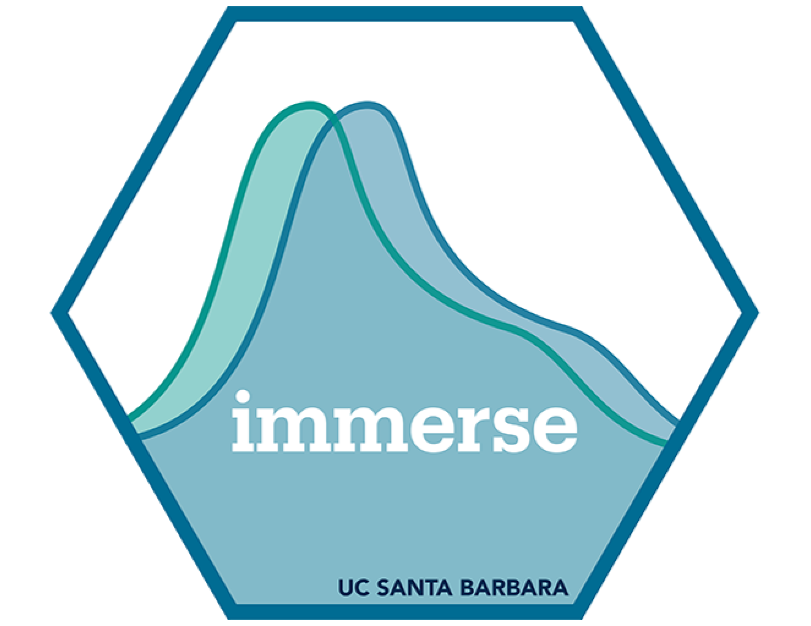
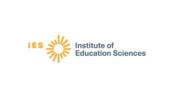

```{r setup, include=FALSE}
knitr::opts_chunk$set(echo = TRUE, warning = FALSE, message = FALSE)
```

This website was made for the 2026 AERA Workshop, "The Utility of Mixture Modeling in Educational Research."

## Description of the AERA course

 This course introduces educational researchers to mixture modeling, a powerful statistical method for exploring unobserved heterogeneity in diverse populations. Led by experienced methodologists, the course will provide a hands-on introduction to person-centered approaches that go beyond traditional statistical methods. The first portion of the course will cover foundational concepts in mixture modeling and latent class analysis, emphasizing their logic, assumptions, and potential in education research. The second portion will walk participants through a demonstration of model estimation in Mplus using sample data. The final portion will include a discussion of mixture modeling extensions and how to apply mixture models in R. This lecture-style course is designed for graduate students, early-career scholars, and advanced researchers who are familiar with latent variable modeling. Laptops are encouraged for hands-on coding, though Mplus is not required.

## Materials for the course

[AERA 2026 Slides (Wednesday, April 8th, 2026)](https://docs.google.com/presentation/d/1ZHpcKpBV-D_ans4ORdbhdL500hHpecVJU6GsWHRHaU0/edit?usp=sharing)

### More tutorials

For more in-depth code and walkthroughs, visit our Bookdown: <https://mixture-modeling.netlify.app/>

## Acknowledgements

<div style="display: flex; align-items: center; gap: 20px;">
  
  <p>The Institute of Mixture Modeling for Equity-Oriented Researchers, Scholars, and Educators (IMMERSE) is an IES funded training grant (R305B220021) to support education scholars in integrating mixture modeling into their research.</p>
</div>

How to reference this workshop: Institute of Mixture Modeling for Equity-Oriented Researchers, Scholars, and Educators (2025). IMMERSE Online Resources (IES No. 305B220021). Institute of Education Sciences. <https://mixture-modeling.netlify.app/>

## Instructors

-   **Karen Nylund-Gibson, PhD**, Principal Investigator

-   **Dina Arch, PhD**, Postdoctoral Scholar

-   **Marsha Ing, PhD**, Co-Principal Investigator

-   **Katherine Masyn, PhD**, Co-Principal Investigator

## Stay in touch!

-   Please [visit our website](https://immerse.education.ucsb.edu/) to learn more about the IMMERSE fellowship.

    -   For all code and materials found in this workshop, see [here](https://github.com/immerse-ucsb/lca-bookdown).

-   Visit our [GitHub](https://github.com/immerse-ucsb) account to access all the IMMERSE training materials.

-   Follow us on [BlueSky](https://bsky.app/profile/immerse-ucsb.bsky.social) and [X](https://twitter.com/IMMERSE_UCSB) to stay-up-to date on our fellowship!


